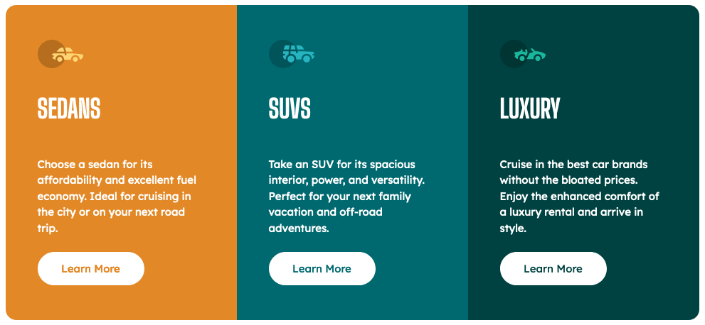

# Frontend Mentor - 3-column preview card component solution

## Table of contents

- [Overview](#overview)
  - [The challenge](#the-challenge)
  - [Screenshot](#screenshot)
  - [Links](#links)
- [My process](#my-process)
  - [Built with](#built-with)
  

### The challenge

Users should be able to:

- NOTE: I've only implemented one media-query, project need some media-queries for best responsive design.

- View the optimal layout depending on their device's screen size
- See hover states for interactive elements

### Screenshot

### Links

- Solution URL: https://github.com/marcos-ortiz-osca/front-mentor-04.git
- Live Site URL: https://marcos-ortiz-osca.github.io/front-mentor-04/

## My process

### Built with

- Semantic HTML5 markup
- CSS custom properties
- Flexbox
- Mobile-first workflow

